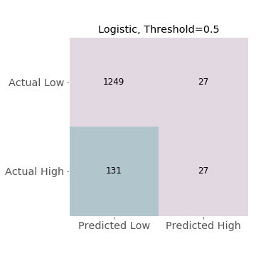

# Help Your Heart

## Introduction

Cardiovascular disease continues to be the leading cause of death in the U.S.  Nearly half of all heart attacks have symptoms so mild that individuals don't know they are having a heart attack--a so-called silent heart attack.  Health professionals estimate that 8 to 11 million people suffer from silent strokes each year in which individuals are asymptomatic but would have evidence of a stroke on an MRI.

Photo by Marcelo Leal on Unsplash

These risks, combined with the ever-increasing cost of healthcare in the U.S., indicate a need for increased diagnostic efficiency.  How can we identify the individuals who are most at risk?  What preventative measures could be implemented to decrease risk?

## Data

NHANES (National Health and Nutrition Examination Survey) is a naitonal survey conducted by the CDC every couple of years.  The survey contains over 1,000 variables, asking questions about lifestyle and medical history as well as conducting brief medical examinations and running blood tests.
The data used in building this model comes from the 2015-2016 survey and can be found at:  
https://wwwn.cdc.gov/nchs/nhanes/continuousnhanes/default.aspx?BeginYear=2015.

The data has been limited to the adult population who participated in both the questionnaire and examination portions of the survey, resulting in 5,735 individuals.  Of the many variables available for analysis, the list was narrowed to 46 variables to use as features in this model.  The elimination process was based first on intuitive relevance to heart disease (e.g. excluding dental health) and second on quality of data (e.g. data with 5,000 missing values).

Individuals in the dataset have been labeled as high-risk for cardiovascular disease based on either:

1. A combination of answers to the Cardiovascular Health questionnaire which indicate symptoms of angina, or
2. Answering the Medical History questionnaire in the affirmative for history of coronary heart disease, angina, heart attack or stroke 
Note: The Cardiovascular Health questionnaire was only administerd to adults age 40+.  The Medical History questionnaire was only administerd to adults age 20+.

## Models

Multiple classification models were considered in order to classify individuals as high-risk (1) or not (0).  About 10% of individuals in the dataset were labeled high-risk; due to class imbalance, only soft classification was used.

The initial baseline model was a logistic regression (without normalization) based on age and gender. The ROC AUC score was 0.79.

After all data cleaning and feature engineering was completed, the following models were explored:

1. Logistic Regression with L2 regularization using normalized data
2. Random Forest Classifier with n_estimators=1000 and min_samples_split=10
3. Gradient Boosting Classifier with n_estimators=1000 and max_depth=2
4. MLP Classifier with hidden_layer_sizes=(100, 2) and a logistic activation function

## Results

Logistic regression appears to have the best predictive ability by a narrow margin.  The Random Forest Classifier and MLP Classifier performed approximately the same. The Gradient Boosting Classifier seems least effective.

Since logistic regression produced the best metrics, a confusion matrix was constructed for this model at different probability thresholds.  The false negative rate, even at lower thresholds, indicates that implementing this model would be impractical due to the high cost associated with false negatives.

Trying to assign dollar values under these circumstances is especially tricky.  Values have been assigned here for a cost matrix based on comparative weights of outcomes, not real-world monetary values.

high-risk, correctly identified----------2,000

high-risk, incorrectly indentified-------(-5,000)

low-risk, correctly identified-----------0

low-risk, incorrectly identified---------(-500)

Do the models assign similar weights to the features when predicting class?  What are the strongest determinants of risk?

