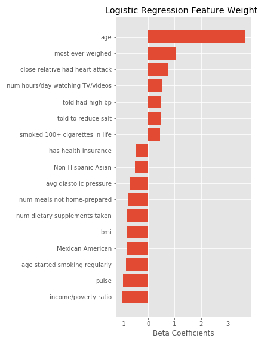
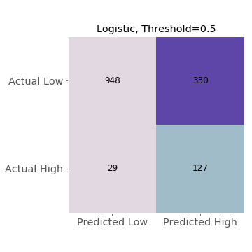

# The Heart of the Matter

## Introduction

Cardiovascular disease continues to be the leading cause of death in the U.S.  Nearly half of all heart attacks have symptoms so mild that individuals don't know they are having a heart attack--a so-called silent heart attack.  Health professionals estimate that 8 to 11 million people suffer from silent strokes  each year in which individuals are asymptomatic but would have evidence of a stroke on an MRI.  These risks, combined with the ever-increasing cost of healthcare in the U.S., indicate a need for increased diagnostic efficiency.  How can we identify the individuals who are most at risk?  What preventative measures could be implemented to decrease risk?

## Data

NHANES (National Health and Nutrition Examination Survey) is a national survey conducted by the CDC every couple of years.  The survey contains over 1,000 variables spread across dozens of files, asking questions about lifestyle and medical history, as well as conducting brief medical examinations and running blood tests.
The data used in building this model was taken from the 2015-2016 survey and can be found at:  
https://wwwn.cdc.gov/nchs/nhanes/continuousnhanes/default.aspx?BeginYear=2015.

There were 16 files used in compiling the data; these were stored in an AWS S3 bucket. The graphic below represents the amount of missing data (shown as white space) encountered in the original compilation (9971 observations, 521 features).

The data was limited to the adult population who participated in both the questionnaire and examination portions of the survey, resulting in 5,735 individuals.  Of the many variables available for analysis, the list was narrowed to produce 63 features for use in evaluating different models.  The elimination process was based first on intuitive relevance to heart disease (e.g. excluding dental health) and second on quality of data (e.g. features with 90% of values missing). After initial data cleaning based on survey response coding and skip patterns, the amount of missing data decreased significantly (see below).

The remaining missing values were replaced using the KNNImputer from scikit-learn.

Individuals in the dataset were labeled as high-risk for cardiovascular disease based on either:

1. A combination of answers to the Cardiovascular Health questionnaire which indicate symptoms of angina, or
2. Answering the Medical History questionnaire in the affirmative for history of coronary heart disease, angina, heart attack or stroke 
Note: The Cardiovascular Health questionnaire was only administerd to adults age 40+.  The Medical History questionnaire was only administerd to adults age 20+.

## Models--Round 1

Multiple classification models were considered in order to classify individuals as high-risk or not.  About 10% of individuals in the dataset were labeled high-risk; due to class imbalance, only soft classification was used. The classification probability threshold was set at 0.5 while examining relative performance between models.

Initial EDA showed that age and gender would be a good starting point for a baseline model upon which to build.

The initial model (using age and gender) was a logistic regression without normalization and had an ROC AUC score of 0.79.

Once a baseline was set, the following models were explored:

1. Logistic Regression with L2 regularization using normalized data
2. Random Forest Classifier with n_estimators=1000 and max_depth=2
3. Gradient Boosting Classifier with n_estimators=1000 and max_depth=2
4. MLP Classifier with hidden_layer_sizes=(100, 2) and a logistic activation function

## Results--Round 1

All models performed similarly based on typcial metrics like log loss and ROC AUC score.  Logistic regression appeared to have the best predictive ability by a narrow margin.

Since logistic regression produced the best metrics, a confusion matrix was constructed for this model at different probability thresholds.  The confusion matrix at threshold 0.5 is shown below.

The false negative rate, even at lower thresholds, indicated that implementing this model would be impractical due to the high cost associated with false negatives.  The model needed greater ability to predict the high-risk label.

## Models--Round 2

Based on previous results, it was clear that the models had difficulty predicting the positive case (i.e high-risk) due to class imbalance.  Given the relatively high cost associated with false negatives, the next goal was to increase recall by reducing class imbalance.  Therefore, the training data was subjected to oversampling of the minority class before fitting models again. The following models produced improvement in recall:

1. Logistic Regression with L1 regularization using normalized data
2. Random Forest Classifier with n_estimators=1000 and max_depth=2
3. Gradient Boosting Classifier with n_estimators=1000 and max_depth=2

## Results--Round 2

Each model showed an increase in log loss, and the ROC AUC scores showed little change from the first round of models.  Each of the models showed improvement in reducing false negatives, but logistic regression still performed best. The plot below shows the beta coefficients for the top features resulting from the updated logistic regression.

Oversampling the minority class and training the model on the top features increased recall from 0.17 to 0.81.  The corresponding trade-off was a decrease in precision from 0.5 to 0.28.  These results were based on a probability threshold of 0.5; lowering the threshold would produce a greater increase in recall and a greater decrease in precision.

## What I Learned

Data quality is the first underlying concern.  Even when surveys are highly-structured and planned carefully, there is plenty of room for error and missing values.  Survey data was used in building this model because it is publicly available, but I suspect the model could be improved by using data from targeted medical research (which is usually restricted from public use).

Class imbalance is the enemy and must be destroyed!  The first models I trained were inclined to predict that no individuals were high-risk.  Implementing a resampling scheme when imbalance exists, whether it's undersampling the majority, oversampling the minority or SMOTE, will greatly benefit the training of the model.  This is especially true when you would prefer to skew your error toward false positives rather than false negatives.

Be mindful of the practical application of the model.  This helps you judge which metrics to use in evaluating potential models--in this case, recall was more important than log loss or AUC because false negatives are especially costly.  It will also guide you in deciding what trade-offs are acceptable.  In this case, health professionals would need to be involved in deciding the acceptable threshold at which the false negatives are low enough to justify the corresponding increase in false positives; the costs associated with these types of error are not equivalent.

### Check out the website for your own prediction

Coming Soon!
