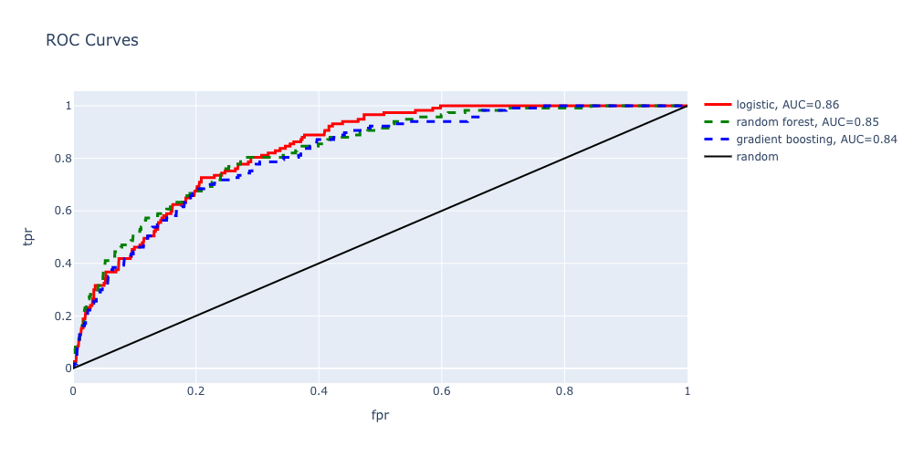
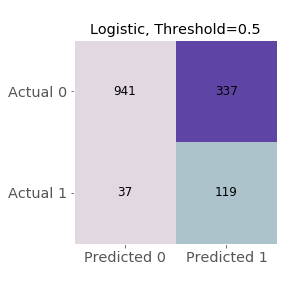

# The Heart of the Matter

## Introduction

Cardiovascular disease continues to be the leading cause of death in the U.S.  Nearly half of all heart attacks have symptoms so mild that individuals don't know they are having a heart attack--a so-called silent heart attack.  Health professionals estimate that 8 to 11 million people suffer from silent strokes each year in which individuals are asymptomatic but would have evidence of a stroke on an MRI.

These risks, combined with the ever-increasing cost of healthcare in the U.S., indicate a need for increased diagnostic efficiency.  How can we identify the individuals who are most at risk?  What preventative measures could be implemented to decrease risk?

## Data

NHANES (National Health and Nutrition Examination Survey) is a national survey conducted by the CDC every couple of years.  The survey contains over 1,000 variables spread across dozens of files, asking questions about lifestyle and medical history as well as conducting brief medical examinations and running blood tests.
The data used in building this model comes from the 2015-2016 survey and can be found at:  
https://wwwn.cdc.gov/nchs/nhanes/continuousnhanes/default.aspx?BeginYear=2015.

There were 16 files used in compiling the data; these were stored in an AWS S3 bucket. The graphic below represents the amount of missing data (shown as white space) encountered in the original compilation (9971 observations, 521 features).

The data has been limited to the adult population who participated in both the questionnaire and examination portions of the survey, resulting in 5,735 individuals.  Of the many variables available for analysis, the list was narrowed to produce 63 features for use in evaluating different models.  The elimination process was based first on intuitive relevance to heart disease (e.g. excluding dental health) and second on quality of data (e.g. features with 90% of values missing). After initial data cleaning based on survey response coding and skip patterns, the amount of missing data decreased significantly (see below).

The remaining missing values were replaced using the KNNImputer from scikit-learn.

Individuals in the dataset have been labeled as high-risk for cardiovascular disease based on either:

1. A combination of answers to the Cardiovascular Health questionnaire which indicate symptoms of angina, or
2. Answering the Medical History questionnaire in the affirmative for history of coronary heart disease, angina, heart attack or stroke 
Note: The Cardiovascular Health questionnaire was only administerd to adults age 40+.  The Medical History questionnaire was only administerd to adults age 20+.

## Models--Round 1

Multiple classification models were considered in order to classify individuals as high-risk or not.  About 10% of individuals in the dataset were labeled high-risk; due to class imbalance, only soft classification was used.

Initial EDA showed that age and gender would be a good starting point for a baseline model upon which to build.

The initial model (using age and gender) was a logistic regression without normalization and had an ROC AUC score of 0.79.

Once a baseline was set, the following models were explored:

1. Logistic Regression with L2 regularization using normalized data
2. Random Forest Classifier with n_estimators=1000 and max_depth=2
3. Gradient Boosting Classifier with n_estimators=1000 and max_depth=2
4. MLP Classifier with hidden_layer_sizes=(100, 2) and a logistic activation function

## Results--Round 1

Logistic regression appears to have the best predictive ability by a narrow margin.  The Random Forest Classifier and MLP Classifier performed approximately the same. The Gradient Boosting Classifier seems least effective.

Since logistic regression produced the best metrics, a confusion matrix was constructed for this model at different probability thresholds.  The false negative rate, even at lower thresholds, indicates that implementing this model would be impractical due to the high cost associated with false negatives.

Trying to assign dollar values under these circumstances is especially tricky.  Values have been assigned here for a cost matrix based on comparative weights of outcomes, not real-world monetary values.

high-risk, correctly identified----------2,000

high-risk, incorrectly indentified-------(-5,000)

low-risk, correctly identified-----------0

low-risk, incorrectly identified---------(-500)

## Models--Round 2

Based on previous results, it was clear that the models had difficulty predicting the positive case (i.e high-risk) due to class imbalance.  Given the relatively high cost associated with false negatives, the next goal was to increase recall by reducing class imbalance.  Therefore, the training data was subjected to oversampling of the minority class before fitting models again. The following models produced improvement in recall:

1. Logistic Regression with L1 regularization using normalized data
2. Random Forest Classifier with n_estimators=1000 and max_depth=2
3. Gradient Boosting Classifier with n_estimators=1000 and max_depth=2

## Results--Round 2

Each of the models showed improvement, but logistic regression still performed best. The plot below shows the beta coefficients resulting from the updated logistic regression.

Oversampling the minority class in the training set increased recall from 0.03 to 0.58.  The corresponding trade-off was a decrease in precision from 0.5 to 0.39.  These results were based on a probability threshold of 0.75; lowering the threshold would produce a greater increase in recall and a greater decrease in precision.

### Check out the website for your own prediction

Coming Soon!
